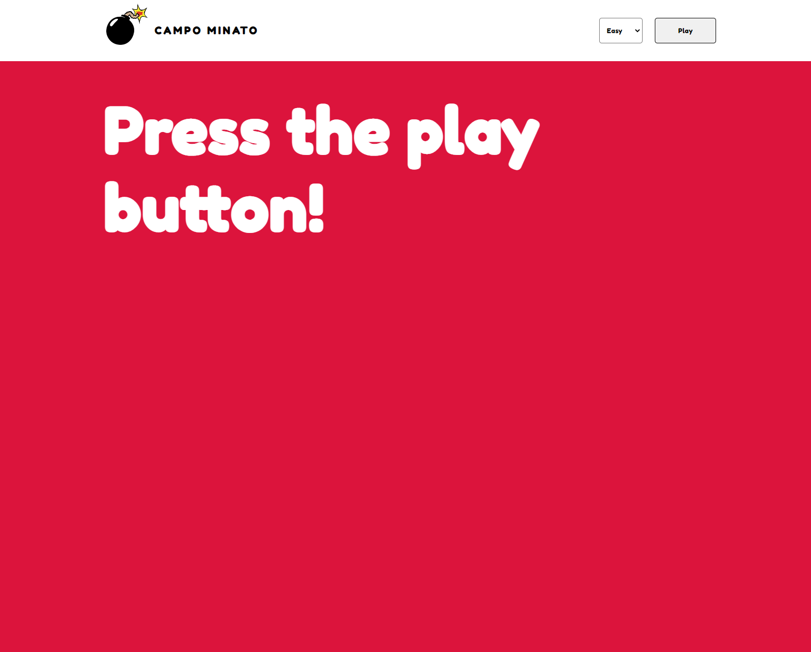

# Campo Minato
This is one of my initial JavaScript exercises, featuring a variation of the beloved game called <b>Minesweeper Flags</b>. The objective is to hit the boxes without triggering any bombs. The game offers three levels of difficulty to choose from. If you can successfully hit each box without triggering any bomb, you emerge as the victor!   Feel free to experience the game by visiting this link: https://enriconapolitano.github.io/js-campominato-dom/

